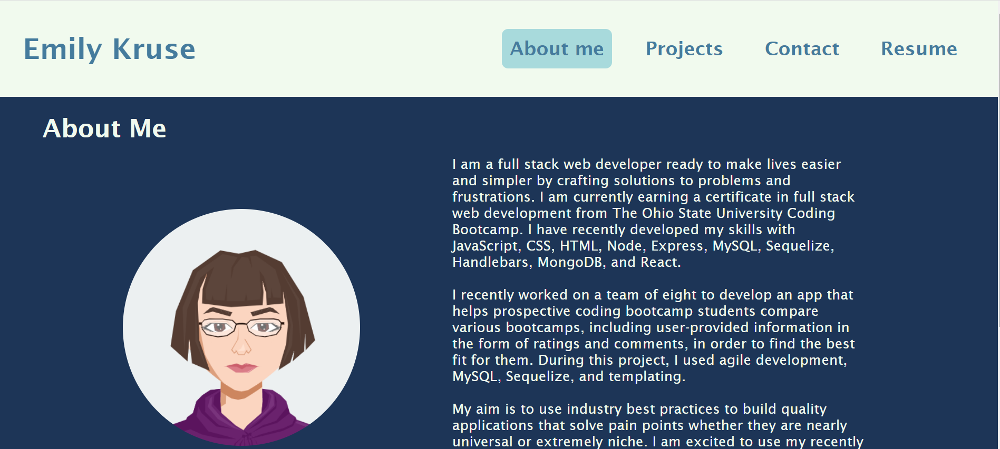
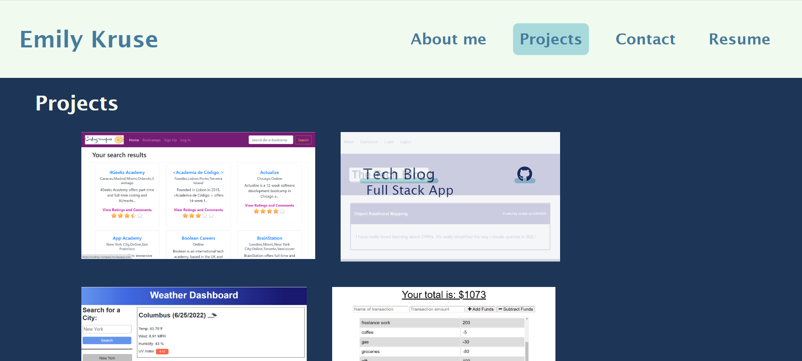

  # Portfolio
  

  ## Description
  This app is built with React and therefore takes advantage of a single-page application format. In practice, this translates to faster load times because the entire page doesn't reload when navigating around but rather only changed sections are rewritten to the page. I built this app to demonstrate my web development abilities and showcase some of the projects I've worked on recently.

  ## Screenshots
  

  

  ## Table of Contents
  * [Usage](#usage)
  * [License](#license)
  * [Questions](#questions)

  ## Usage
  This webpage can be found at [http://emilyk221.github.io/portfolio](http://emilyk221.github.io/portfolio).
  From there, you may read about me, view a selection of my projects, contact me, and download my resume.

  ## License
  
    Copyright 2022 by emilyk221.

    Licensed under the MIT license.
    Permission is hereby granted, free of charge, to any person obtaining a copy of this software and associated documentation files (the "Software"), to deal in the Software without restriction, including without limitation the rights to use, copy, modify, merge, publish, distribute, sublicense, and/or sell copies of the Software, and to permit persons to whom the Software is furnished to do so, subject to the following conditions:
    The above copyright notice and this permission notice shall be included in all copies or substantial portions of the Software.
    
  [https://opensource.org/licenses/MIT](https://opensource.org/licenses/MIT)

  ## Questions
  Please visit my GitHub profile [here](https://github.com/emilyk221) for more information about this and other projects.
  